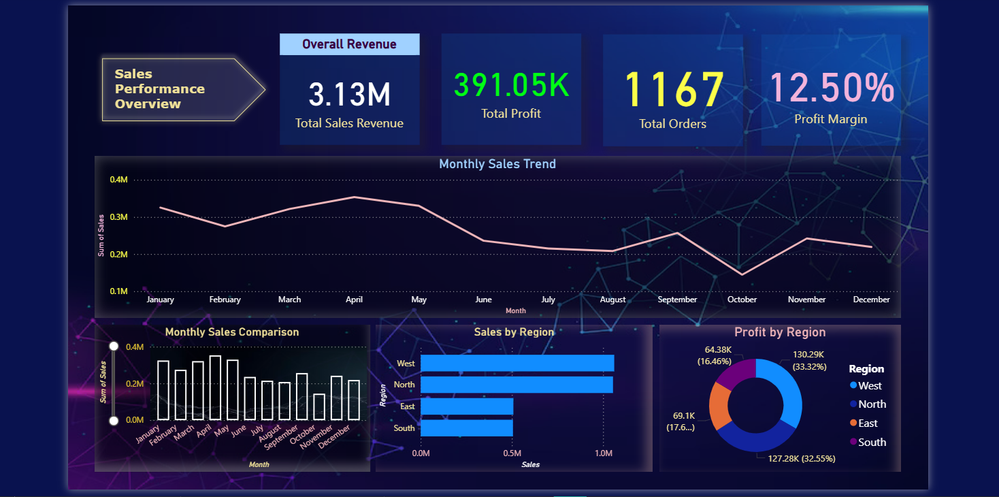

<h1>| Sales Intelligence Dashboard |</h1>

<h2><b>1. Project Title</b></h2>

Sales Intelligence Dashboard – A Power BI project analyzing sales performance, product profitability, pricing impact, and customer contribution.

<h2><b>2. Purpose</b></h2>

This project demonstrates how **Power BI can be used to transform raw sales data into actionable business insights**.

The dashboard helps analyze:
<ul>
<li>Overall sales performance</li>
<li>Product revenue contribution</li>
<li>Profitability patterns</li>
<li>Discount impact on profit</li>
<li>Top customers contributing to revenue</li>
</ul>

The goal of this project is to simulate how **data analysts build business intelligence dashboards for decision making**.

<h2><b>3. Tech Stack</b></h2>

* Power BI – Dashboard development and data visualization.
* Power Query – Data transformation and cleaning layer for reshaping and preparing the data.
* Microsoft Excel (.xlsx) – Dataset storage.
* DAX (Data Analysis Expressions) – Used for calculated measures, dynamic visuals, and conditional logic.
* Data Modeling – Relationships established among tables (resorts, snow, and data_dictionary) to enable cross-filtering and aggregation.
* File Format – .pbix for development and .png for dashboard previews.

<h2><b>4. Data Source</b></h2>

The dataset used in this project is a **synthetic sales dataset generated for analytical and demonstration purposes**.

The dataset contains simulated sales transaction records including:
* Product name and category
* Customer identifiers
* Sales revenue
* Profit values
* Discount levels
* Order information

<h2><b>5.	Features and Highlights</b></h2>

<h3>Business Problem</h3>

Retail businesses generate large volumes of transactional sales data, but raw data alone makes it difficult to quickly answer important business questions.

Decision makers often struggle to identify:
* Which products generate the most revenue
* Which categories drive the highest profit
* Whether discount strategies impact profitability
* Which customers contribute the most revenue
* How sales performance changes over time

Without a clear analytical view, extracting these insights from raw spreadsheets becomes time-consuming and inefficient.

<h3>Goal of the Dashboard</h3>

The goal of this dashboard is to create an **interactive Business Intelligence tool** that transforms raw sales data into clear visual insights.
    
The dashboard enables users to:
* Monitor overall business performance using key sales KPIs
* Identify high-performing products and categories
* Analyze profitability across product segments
* Understand the relationship between discount levels and profit
* Discover the customers contributing the highest revenue.

This dashboard demonstrates how **data analysts convert transactional data into                                               decision-support insights using Power BI**.
  

<h3>Walkthrough of Key Visuals</h3>

<b>Key Performance Indicators</b>
The dashboard highlights important business metrics to provide a quick performance overview.
<b>KPIs include:</b>
* Total Sales Revenue
* Total Profit
* Total Orders
* Profit Margin
These indicators provide an immediate snapshot of overall business performance.

**Monthly Sales Trend (Line Chart)**
Displays how sales change across different months, helping identify seasonal trends and sales growth patterns.
   
**Regional Sales & Profit Comparison (Bar Charts)**
Two bar charts compare:
* Sales revenue by region
* Profit generated by region
This helps identify the most profitable geographic markets.

**Revenue by Product Category (Donut Chart)**
Shows how different product categories contribute to total revenue, helping identify dominant product segments.

**Top 10 Revenue Generating Products (Bar Chart)**
Ranks the products generating the highest sales revenue, highlighting the most valuable items in the product portfolio.

**Profit Contribution by Category (Treemap)**
Treemap visualization illustrates how different categories contribute to overall profit.
Larger blocks represent categories generating higher profit.

**Discount vs Profit Relationship (Scatter Plot)**
This visual explores how discount levels influence profit performance, helping evaluate pricing strategy.
   
**Top Customers by Revenue (Bar Chart)**
Identifies the customers contributing the highest revenue, helping businesses recognize their most valuable clients.

<h3>Business Impact & Insights</h3>

**Revenue Optimization**
Businesses can identify high-performing products and categories that drive the majority of sales.

**Profitability Monitoring**
Category-level profit analysis helps detect segments that generate strong margins or require improvement.

**Pricing Strategy Evaluation**
The relationship between discounts and profit provides insights into whether aggressive discounting affects profitability.

**Customer Value Identification**
Recognizing top revenue-generating customers helps companies prioritize key accounts and strengthen relationships.

**Strategic Decision Support**
The dashboard provides a consolidated analytical view that supports faster and more informed business decisions.

<h2><b>6. Screenshots</b></h2>

